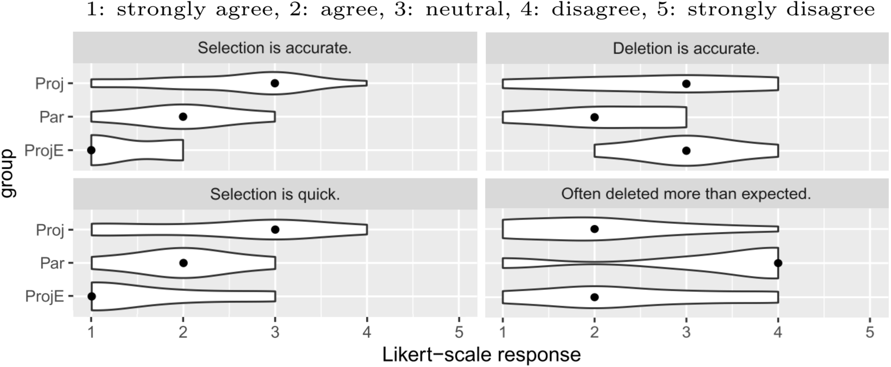
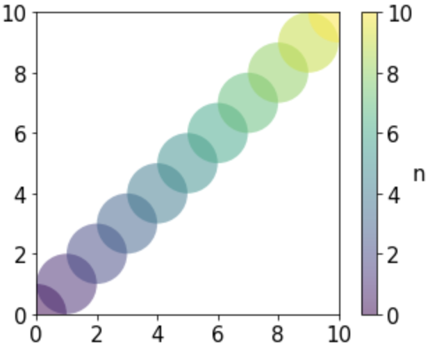
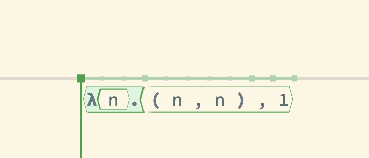
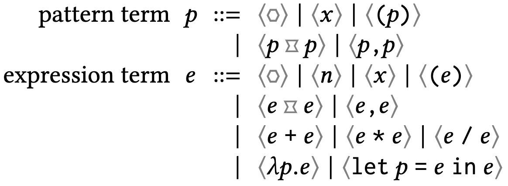
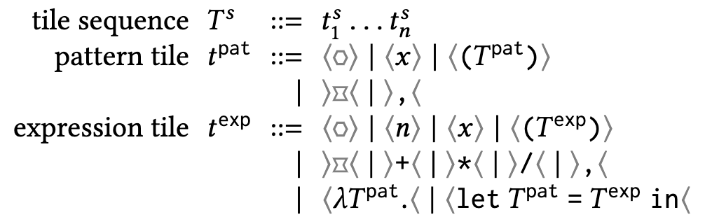
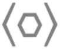
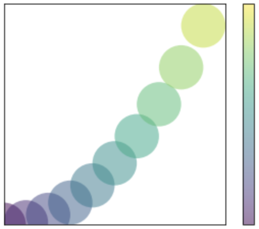
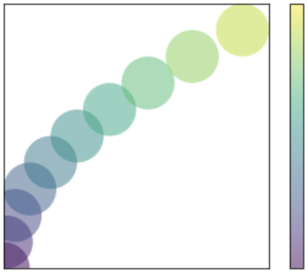
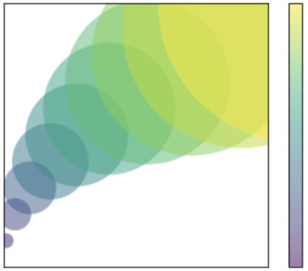
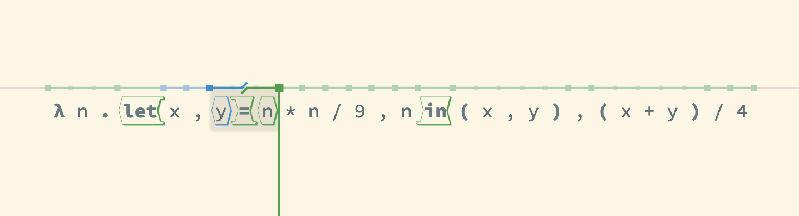

---
title: Restructuring Structure Editing
date: 19-08-2021
...

# Introduction
<!-- \label{sec:intro} -->

*Structure editors*
have long promised to improve the programming experience
for beginners and experts alike.
By eliminating parse errors,
they provide cognitive benefits for novices
[@meta-analysis-blocks;@blocks-text-high-school;@coblox]
and end-users
[@weitnauer2016graspable;@rousillon;@BasHermans21];
  simplify language composition
  [@mbeddr]
  and language-aware editor tooling
  [@HazelnutSNAPL];
  and form an essential component of truly continuous live programming
  [@Hazelnut;@HazelnutLive].
Yet, in the forty years since the idea was first
introduced and implemented [@Cornell],
structure editing has failed to reach
mainstream use by programmers beyond the novice level.
The problem, as many have observed
[@user-modeling;@fine-tuning-selection-semantics;
@practical-lang-based-editing;@lang-on-the-usefulness;
@psg;@Minor92;@TowardUserFriendly;@MillerPMV94],
is that structure editors can be too slow
or difficult to use.

For example, while
block-based editors like Scratch [@scratch]
excel at introducing programming
to children and end-users, they soon become unwieldy
as users gain experience and create larger programs.
Cited issues include their inefficient mouse-driven
input, low visual information density, and rigid
tree-based construction of operator sequences
[@BlocksFingertips;@cog-dim-blocks;@blocks-and-beyond].

Other structure editors like JetBrains MPS
[@DBLP:conf/icse/VoelterP12]
resolve those particular issues with
keyboard-driven text-like interfaces, but instead suffer
from steep learning curves and difficult-to-predict
editing behavior.
Consider the violin plots below, adapted from [@ProjEfficiency],
<!-- \ref{fig:mps-violin-plots}, -->
that show post-task questionnaire responses from
a controlled user study of MPS.
Each plot partitions the user responses by study groups:
novice MPS users (Proj), expert MPS users (ProjE), and
text editor users (Par).
The left two plots show that MPS novices felt that
selection was relatively slow and inaccurate despite
a 45-minute training session and another 30-45 minutes
worth of study tasks.
Meanwhile, the right two plots show that
MPS novices and *experts* alike struggled to
predict the effects of deletion.

Whether they are mouse-driven and block-based,
or keyboard-driven and text-like,
structure editors as a whole have suffered
from high viscosity [@cog-dim],
i.e., it is difficult to modify
and restructure existing code.
We believe this is a fundamental consequence
of the basic assumption that structure editors
should operate directly on the abstract syntactic structure
of a program.
<!-- \footnote{\note{add comment here clarifying
this is talking about pure structure editors and not
hybrid ones and forward reference to related work}} -->
This assumption restricts selections to complete
program terms, a severe limitation compared to
the arbitrary range selections of text editors.
<!-- \note{come back if there's time and talk a bit about
Amy's thing and weave in a little more text editor vs
structure editor dichotomy earlier} -->

In this essay, we describe a new approach to structure
editing, called *tile-based editing*, that
recovers many of the flexible and linear editing
affordances of text editors.
The key insight is that, in order to guarantee edit state
well-formedness, it is sufficient to maintain a structure
more relaxed than the abstract syntactic structure demands,
but on which parsing is guaranteed to succeed.

Using a tile-based editor, the user manipulates
structural components called *tiles* that
are shaped to fit together according to their
syntactic roles, *à la* blocks in a block-based editor.
Unlike blocks, tiles directly model linear
operator sequences and facilitate left-to-right
editing using keyboard input.

<!-- have a figure just to give initial taste -->

Uniquely, tiles may be broken apart into
*shards* as needed to specify arbitrary range
selections up to token boundaries.
Using a novel *restructuring mode*, the user
may then "cut and paste" these selections like
in a text editor.
Unlike text-based cut-and-paste, however, restructuring
mode ensures you paste your selections such that
the result is a well-formed program term.

<!-- show an example of shard selection + restructuring -->

<!-- bullet point maintaining tile structure + hole fixing -->

# Overview

We now present an example-driven overview of tile-based
editing using `tylr`, a tiny tile-based editor.
Interested readers may follow along on a running instance of `tylr`
at [tylr.fun](https://tylr.fun).

Say we are using `tylr` to edit a function that gets called by a
generative drawing application [@sns-pldi].
The function takes an integer index and
returns a circle—represented as a pair comprising
its center point and radius—to be drawn in
the $xy$-plane for every index.
The initial program draws unit circles
along the line $y = x$, as shown below.

{ width=175px }
{ width=350px }

## Terms versus tiles

Panning the cursor over the program in `tylr`
reveals the program structure as
governed by `tylr`'s *term syntax*,
the relevant subset of which is included below.

{ width=300px }
{ width=350px }

For example, the first edit state seen in the video
shows the top-level function---an expression term as
indicated by the green coloring---binding
the pattern variable \code{n} and returning an indexed circle.
Notice how every term has a convex hexagonal shape.

Highlighted within each term is a substructure called a *tile*;
with respect to the containing term, we say it is the term's *root tile*.
Each term's root tile encompasses all root-level tokens used to
represent the term, along with children of the term that the tokens
delimit on both sides---such children we call *bidelimited*.
For example, in the first edit state of
the video above, observe how the function's highlighted
tile spans the function's tokens $\boldsymbol{\lambda}$
and $\textbf{.}$
as well as the bidelimited pattern child; however, it does not
extend to the *unidelimited* body child.

Holding Alt/Option while panning the cursor
reveals the program structure
as governed by `tylr`'s *tile syntax*,
shown below.

{ width=300px }
{ width=400px }

Tiles enjoy a flatter structure compared to the
strictly hierarchical terms.
Notice in the first edit state seen in the video,
for example, how the tiles comprising the function body
are siblings with the function term's root tile.
The *tips* of a tile indicate its syntactic
role in the tile sequence as a(n):

- $\langle$operand$\rangle$,
- $\langle$prefix operator$\langle$,
- $\rangle$postfix operator$\rangle$, or
- $\rangle$infix operator$\langle$.

Where traditional structure editors model their edit states
using the strictly hierarchical term syntax,
`tylr` instead models its edit state using the flatter
tile syntax, precedence-parsing the tile structure
as needed to produce the term structure.
Indeed, the term structure shown in the first video
is simply a decoration overlaid atop the actual tile
structure shown in the second video.
Moving forward, we will refer to structure editors
with term-structured edit states as *term-based editors*.

## Opseqs and holes

The edit states above are in
*pointing mode*, `tylr`'s default editing mode.
Much like how a text editor's cursor points at positions
between characters in its default mode, `tylr`'s default
cursor points at positions between tiles.
<!-- % \note{note how they are explicitly indicated in above
% the terms/tiles, the local cursor positions for the current tile
% sequence are shown, that we can speak meaningfully of the
% sort of a cursor position, maybe forward reference that
% this will be useful for explaining how selecting works} -->
`tylr`'s central guarantee is: if you are in pointing mode,
then you have a well-formed program term.

\newcommand{\ltiletip}{{\color{gray}\langle}}
\newcommand{\rtiletip}{{\color{gray}\rangle}}

Simply maintaining a well-formed tile structure
according to the tile syntax alone, however, is
not sufficient to uphold this guarantee.
The generic sequential structure of tile sequences
simplifies how we define edit operations, but
does not guarantee that the tiles represent a well-formed
*operator sequence*, or *opseq* for short.
The qualifications for a tile sequence to an opseq
enjoy a simple physical metaphor:

1. every tile *fits* its siblings:
  if a pair of tips meet, they look like $\langle\langle$
  or $\rangle\rangle$; and
2. every tile sequence is *convex*:
  it is nonempty, the first tile's left tip $\langle$
  points left, and the last tile's right tip $\rangle$
  points right.

If `tylr` maintains the opseq structure in pointing mode, then we have
our guarantee, since precedence-parsing is total on opseqs.

For this reason, `tylr` automatically inserts
and removes placeholder tiles called *holes*
as we edit to maintain opseq structure.
There are two kinds of holes:
*operand holes* { width=1em }
and *operator holes* { width=1em }.
We will soon see a number of examples of
automatic hole fixing as we turn our attention
to editing.

## Inserting and removing
By having us edit the tile structure, and only indirectly
propagating those changes to the term structure, `tylr`
supports many of the linear editing workflows to which
we are accustomed in text editors.

__Inserting and removing leaf tiles.__
For example, say we update our program to draw circles along
the parabola $y = x^2/9$.
{ width=60px }
We can accomplish this simply by
typing left-to-right:

{ width=350px }

If we decided now to draw circles along the reflected parabola
$x = y^2/9$,
{ width=60px }
we could similarly remove the inserted tiles right-to-left
from the $y$-coordinate and re-insert them in the $x$-coordinate.

{ width=350px }

These simple editing workflows are not trivial
in traditional term-based editors because,
from the perspective of the AST, linear construction of
operator sequences is a complex, context-sensitive operation.
Existing structure editors either embrace strictly tree-based
construction of operator sequences [@scratch];
defer to text at the expression level [@Cornell;@greenfoot],
recovering linearity at the cost of structure;
or solve the problem at the cost of complexity
[@GrammarCells].
In contrast, tiles combined with automatic hole fixing
make it easy to define linear editing operations
without compromising structure.

<!-- Tiles enable linear editing of operator sequences,
while continuously maintaining structure and
relying on simple precedence parsing
to update the operator sequence's associative structure
as you type. -->

__Inserting and removing non-leaf tiles.__
While insertion and removal of leaf tiles closely mimics the
text editing experience, this begins to change as we turn our
attention to non-leaf tiles.
For example, consider how we would remove the parentheses
wrapping the origin coordinates in `tylr`:

{ width=350px }

Where a text editor would simply remove the closing parenthesis
on the first Backspace, leaving us with a syntax error,
`tylr` first enters an intermediate state in which it has
"picked up" the closing parenthesis and highlighted the
matching opening parenthesis.
Pressing Backspace again then removes both parentheses.

This intermediate state is called *restructuring mode*,
and we picked up the closing parenthesis into the *backpack*;
we will soon discuss these at greater length.
For now, notice how restructuring mode served as a
sort of confirmation dialog, showing us that removing
the token on which we hit Backspace would require
deleting other tokens.
We believe such explicit confirmation is important to
prevent "spooky action at a distance", especially
in light of the MPS user data discussed in the introduction.
<!-- At the same time, the total number of keypresses (2) is
the same as would be required in a text editor. -->

Now consider how we might re-insert the parentheses
around the origin coordinates.

{ width=350px }

In a dual fashion to removal, inserting
an opening parenthesis enters restructuring mode with its
matching closing parenthesis in the backpack.
Restructuring mode then allows us to move the parenthesis
to the right and put it down.
Notice the similarity to the text editing experience,
which has an invoke-then-configure flow, whereas a typical
structure editor would require you to select the body before
parenthesizing, forcing preemptive configuration before
invocation.

MPS supports a similar editing flow for parentheses in particular,
but not any other syntactic forms also with matching delimiters.
In contrast, as we will see next, `tylr` has well-defined
restructuring behavior for arbitrary range selections.

## Selecting and restructuring

Using the arrow keys while holding
Shift enters `tylr`'s *selecting mode*.

{ width=350px }

Selecting mode lets us specify arbitrary range selections up
to token boundaries.
Notice how, when a tile is divided by a selection boundary,
it is disassembled into individual *shards*;
then, once they are all within or without the selection,
the shards are reassembled into the original tile.
A selection containing no shards is called *intact*, otherwise
*cracked*.

We may understand restructuring mode, not simply as a tile insertion
and removal aid, but more generally as a structured variant of
cut-and-paste on range selections, regulated by their intact versus
cracked structure.

__Restructuring with a full backpack.__
In the previous section, we updated the circle drawing tracing the
parabola $y = x^2/9$ to its reflection $x = y^2/9$ by deleting
and re-inserting tiles.
Alternatively, we could have selected those tiles—an impossible
selection in a term-based editor—and used
restructuring mode to move them.

{ width=350px }

We say that your backpack is *full* whenever its contents are,
or could be assembled into, an intact selection.
If your backpack is full, then you may move freely, since
you may insert a selection of whole tiles anywhere without
compromising the existing shard-balanced structure.

Often, however, your backpack's contents are not an intact
selection, nor can they be assembled into one, as we observed
in the parentheses insertion and removal examples in the
previous section.
In that case, we say that your backpack is *hungry*...

__Restructuring with a hungry backpack.__
Now we would like the circles' radii to grow
with their origin coordinates.
{ width=60px }
Accordingly
we insert a let tile introducing variables `x` and `y`
in the function body.

{ width=500px }

Our remaining task is to restructure our code so that `x`
and `y` are bound to the origin coordinates
`( n * n / 9 , n )` currently in the body of the let term.
We select the `in` delimiter, disassembling the `let`-tile
into a pair of shards; move right once; and put it down,
upon which `tylr` reassembles the `let`-tile
and returns us to pointing mode.

{ width=500px }

Notice that we skipped all cursor positions within
the parentheses tile when we moved right.
The `in`-shard in your backpack cannot be assembled into
an intact selection on its own, meaning at least one matching shard—in
this case, `let x , y =`—is
anchored within the current tile sequence.
This restricts our movement of the `in`-shard
to cursor positions of the same sequence,
as placing it in any other position would
violate proper shard balancing.

We call the backpack full or hungry as a way
to narrativize its control of our movement.
When the backpack is full, it is satisfied
and lets us move freely and leisurely through
our code.
When our backpack is hungry, it accelerates our
movement through the current tile sequence
in its impatience to end its hunger, which can happen in one of two ways.
Either, like in the last example, we can empty the backpack,
freeing it of all earthly possessions and desires;
or we may feed it.

__Feeding a hungry backpack.__
Now we rewrite the radius in terms of the variables `x` and `y`.

{ width=600px }

Along the way, however, we forgot to parenthesize
the origin coordinates.
We also notice that the parentheses in the definition
of the `let`-tile are now redundant and decide
to recycle them.
We move the cursor to the right parenthesis, select it,
and pick it up into the backpack.
At this point the backpack is hungry and restricts
our movement to the tile sequence within the
let definition.

{ width=600px }

Instead of emptying our backpack like in the
last example, this time we move over to the
left parenthesis and pick it up as well.
At this point our backpack is full, as it carries both shards
needed to assemble a parentheses tile, and we may
move freely again.

{ width=600px }

__Picky eater.__
Not all selections can be picked up.
We call the cursor positions marking the ends of a selection
the selection's *caps*.
So far we have only encountered selections with caps
of the same sort.
Your backpack is a picky eater in the sense that
it will refuse to carry any selections with caps of
different sort.

Consider, for example, the following selection.

{ width=600px }

The left cap is pattern-sorted while the right cap
is expression-sorted, as indicated by the two-toned
broken overline.
Picking up this selection would bring together
tiles of different sort, so you are prevented from doing so.